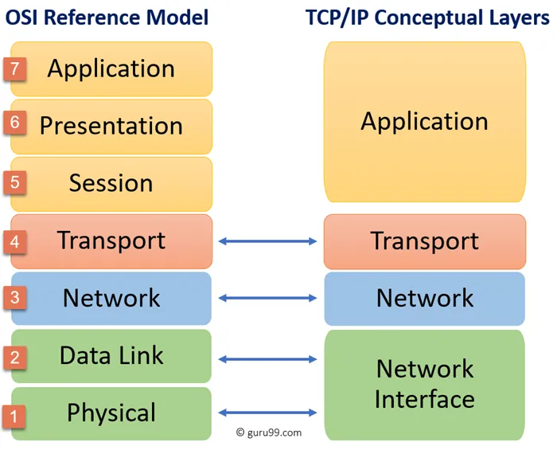

# What I need to know from networks and HTTP:

# Intoduction:

before we start in backend, we should get some knowledge in internet,

The internet started as a project funded by the U.S. government, so two computers can communicate with each other.

> search for: ARPANET 1969.
> 

today, it become the internet (interconnected networks).

it follows the TCP/IP stack which is an application of the ISO model.



for this workshop scope we will talk a bit from Network Layer:

1. Network Layer:
    
    networks are separated and connected with each others by routers.
    
    inside the network computers can be connected to a switch or directly to a router.
    
    network and computers are identified by **IP addresses**.
    
    ### types of IP addresses:
    
    there many IPv4 addresses types, but I want you to know these three:
    
    1. public IP addresses: it is reachable through the internet.
        
        ex: 142.250.201.14
        
    2. private IP addresses: it is reachable only through the local network.
        
        there is three ranges:
        
        8.0.0.0 > 8.255.255.255
        
        172.16.0.0 > 172.32.0.0
        
        192.168.0.0 > 192.168.255.255
        
    3. loop back addresses: it refers to your local machine.
        
        there is one range: 127.0.0.0 > 127.255.255.255
        

1. Transport Layer:
    
    there is two main protocols on this layer:
    
    - **TCP (Transmission Control Protocol):**
        - Provides reliable connection.
        - connection-oriented communication (requires three way hand-shake).
        - Ensures data is delivered in order and without errors.
        - Uses acknowledgments, re-transmissions, and flow control mechanisms.
    - **UDP (User Data gram Protocol):**
        - Provides unreliable connection.
        - connection-less oriented communication.
        - Delivers data without guaranteeing order or delivery.
        - Has low overhead, making it faster than TCP.
    - TCP is suitable for applications like web browsing, email, and file transfers.
    - UDP is ideal for real-time applications like video streaming, gaming, and voice over IP (VoIP).
        
        
    
    it starts by binding a PORT to a process (your software / app).
    
    a port can not be binded with another process.
    
    ### but what is a PORT?
    
    > A **port** is a **logical address** that helps identify **specific processes or services** on a device in a network.
    > 
    
    so a computer can have many processes communicating thrrough the network, to make a difference between them and each process receives the corresponding (message, data, ..), so it is binded to a unique PORT. 
    
    Ports are **16-bit numbers**, so the range is: **`0 - 65535`**
    
    ### Types of Ports:
    
    | Port Range | Name | Usage | Server/client app |
    | --- | --- | --- | --- |
    | **0 – 1023** | **Well-known ports** | Reserved for standard services (e.g., HTTP, SSH) | Server side app |
    | **1024 – 49151** | **Registered ports** | Assigned to user or vendor applications | Server side app |
    | **49152 – 65535** | **Dynamic / Private ports** | Used temporarily by clients for outbound connections | client side app |
    
    ### Well Known Ports:
    
    | Port | Protocol | Service |
    | --- | --- | --- |
    | 20 | TCP | FTP (Data transfer) |
    | 21 | TCP | FTP (Control) |
    | 22 | TCP | SSH (Secure Shell) |
    | 23 | TCP | Telnet |
    | 25 | TCP | SMTP (Simple Mail Transfer Protocol) |
    | 53 | UDP/TCP | DNS (Domain Name System) |
    | 67 | UDP | DHCP (Server) |
    | 68 | UDP | DHCP (Client) |
    | 69 | UDP | TFTP (Trivial File Transfer Protocol) |
    | 80 | TCP | HTTP (Web Traffic) |
    | 110 | TCP | POP3 (Post Office Protocol v3) |
    | 119 | TCP | NNTP (Network News Transfer Protocol) |
    | 123 | UDP | NTP (Network Time Protocol) |
    | 143 | TCP | IMAP (Internet Message Access Protocol) |
    | 161 | UDP | SNMP (Simple Network Management Protocol) |
    | 194 | TCP | IRC (Internet Relay Chat) |
    | 443 | TCP | HTTPS (Secure Web Traffic) |
    | 445 | TCP | SMB (Server Message Block for file sharing) |
    | 465 | TCP | SMTP over SSL |
    | 514 | UDP | Syslog |
    | 587 | TCP | SMTP (Email Submission) |
    
    ### 🔓 **Registered Ports**
    
    | Port | Protocol | Service |
    | --- | --- | --- |
    | 1433 | TCP | Microsoft SQL Server |
    | 1521 | TCP | Oracle DB |
    | 2049 | TCP/UDP | NFS (Network File System) |
    | 2082 | TCP | cPanel |
    | 3306 | TCP | MySQL |
    | 3389 | TCP | RDP (Remote Desktop Protocol) |
    | 5432 | TCP | PostgreSQL |
    | 5900 | TCP | VNC (Virtual Network Computing) |
    | 8080 | TCP | HTTP Alternate (often used for web servers) |
2. Application Layer:
    
    it is built on top of one of Transport Layer protocols.
    
    - **No data transport role:**
        
        it doesn't manage the transport of data itself — that’s the job of lower layers like the **Transport Layer** (Layer 4).
        
    - **User authentication and data privacy:**
        
        Can handle tasks like user logins, authentication, and sometimes data encryption (depending on the protocol).
        
    - **data formatting:**
        
        each protocol follows a specific data formatting, so the client and server software understand each others.
        
    
    ### Most known Application Layer protocols:
    
    **1. FTP (File Transfer Protocol)**
    
    - **Server Port:** 20, 21.
    - **Used for:** File uploads/downloads
    
    **2. SSH (Secure Shell)**
    
    - **Server Port:** 22
    - **Used for:** Secure remote login (ex: login to a server)
    
    **3. DNS (Domain Name System)**
    
    - **Server Port:** 53
    - **Used for:** Resolving domain names to IP addresses
    - **Description:** Translates human-readable domain names (like google.com) into machine-readable IP addresses.
    
    but there is one famous protocol we didn’t mention:
    
    # HTTP
    
    - **Server Port:** 80
    - **Used for:** Web browsing
    
    it Enables communication between web browsers and web servers.
    
    It transfers hypertext (HTML) documents and other web resources (images, videos, JSON, XML, …).
    
    It is built on top of TCP.
    
    **operates over TCP:** It uses the Transmission Control Protocol to establish a reliable connection between client and server.
    
    it is a text based protocol
    
    **It is a stateless protocol:** Each HTTP request is independent; the server doesn’t remember previous requests from the same client unless cookies or sessions are used.
    
    **It follows a request-response model:** The client (usually a web browser) sends an HTTP request, and the server responds with the requested content (like an HTML page, JSON).
    
    both request and response have similarities, (headers, body …)
    
    ## HTTP Request format:
    
    1. **methods:**
    
    ex : 
    
    | Method | Safe | Idempotent | Cacheable | Description |
    | --- | --- | --- | --- | --- |
    | GET | ✅ | ✅ | ✅ | Retrieves data from the server |
    | POST | ❌ | ❌ | ❌ (🔸) | Submits data to be processed |
    | PUT | ❌ | ✅ | ❌ | Replaces resource with new data |
    | PATCH | ❌ | ❌ (🔸) | ❌ | Partially updates a resource |
    | DELETE | ❌ | ✅ | ❌ | Deletes the specified resource |
    | OPTIONS | ✅ | ✅ | ❌ | Describes communication options |
    | HEAD | ✅ | ✅ | ✅ | Same as GET but returns only headers |
    - **Safe:** Does not modify resources (database).
    - **Idempotent:** Can be repeated without different outcomes (there is no side effect when making a request).
    - **Cacheable:** Can be stored in cache for reuse.
    1. **Version: 1.1/ 1.2/ ..**
    2. **Headers:**
    
    | Header | Purpose | Example |
    | --- | --- | --- |
    | **Host** | Specifies the domain name of the server | `Host: api.example.com` |
    | **User-Agent** | Identifies the client (browser, app, etc.) making the request | `User-Agent: Mozilla/5.0 (Windows NT 10.0; Win64; x64)` |
    | **Content-Type** | Specifies the type of data being sent in the body (for POST/PUT) | `Content-Type: application/json` |
    | **Accept** | Informs the server what content types the client can handle | `Accept: text/html, application/json` |
    | **Accept-Encoding** | Lists the encoding types the client can handle (e.g., gzip) | `Accept-Encoding: gzip, deflate, br` |
    | **Cookie** | Sends cookies from the client to the server | `Cookie: session_id=abc123; theme=dark` |
    | **Authorization** | Sends credentials for authenticating with the server | `Authorization: Bearer <token>` |
    | **Connection** | Controls whether the connection stays open | `Connection: keep-alive` |
    | **Cache-Control** | Tells the server how the client wants caching handled | `Cache-Control: no-cache` |
    | **Content-Length** | Specifies the size of the body in bytes | `Content-Length: 348` |
    
    some advanced headers:
    
    | Header / Term | Description | Example |
    | --- | --- | --- |
    | **Origin** | Specifies the origin (protocol + host + port) of the client | `Origin: https://example.com` |
    | **Access-Control-Allow-Origin** | Indicates which origins are allowed to access the resource | `Access-Control-Allow-Origin: https://example.com` |
    | **Access-Control-Allow-Methods** | Specifies which HTTP methods are permitted | `Access-Control-Allow-Methods: GET, POST, OPTIONS` |
    | **Access-Control-Allow-Headers** | Lists headers the server permits in requests | `Access-Control-Allow-Headers: Content-Type, Authorization` |
    | **Access-Control-Allow-Credentials** | Indicates if cookies/auth headers can be sent | `Access-Control-Allow-Credentials: true` |
    | **Access-Control-Max-Age** | How long the preflight response can be cached (in seconds) | `Access-Control-Max-Age: 86400` |
    | **Access-Control-Request-Method** | States which method will be used in the actual request | `Access-Control-Request-Method: POST` |
    | **Access-Control-Request-Headers** | Lists headers the client wants to use in the actual request | `Access-Control-Request-Headers: Content-Type, Authorization` |
    | **Preflight Request** | Sent before non-simple requests to check if they're allowed | `OPTIONS /api/data` |
    | **Simple Request** | A basic cross-origin request (e.g., `GET` with no custom headers) | `GET /data` |
    | **Referer** *(yes, typo is standard)* | Indicates the URL of the page that made the request | `Referer: https://google.com` |
    
    request example:
    
    ```jsx
    POST /users HTTP/1.1
    Host: example.com
    Content-Type: application/x-www-form-urlencoded
    Content-Length: 49
    
    name=FirstName+LastName&email=bsmth%40example.com
    ```
    
    ## HTTP Response Format:
    
    1. status code:
        
        **1xx – Informational**
        
        | Code | Name | Description |
        | --- | --- | --- |
        | 100 | Continue | Request received, continue process |
        | 101 | Switching Protocols | Client asked to switch protocols |
        | 102 | Processing | Server is still processing |
        
         **2xx – Success:**
        
        | Code | Name | Description |
        | --- | --- | --- |
        | 200 | OK | Request succeeded |
        | 201 | Created | Resource created successfully |
        | 202 | Accepted | Request accepted, not yet processed |
        | 204 | No Content | Success, but no content to return |
        | 206 | Partial Content | Partial data returned (e.g., for ranges) |
        
        3xx – Redirection:
        
        | Code | Name | Description |
        | --- | --- | --- |
        | 301 | Moved Permanently | Resource has permanently moved |
        | 302 | Found | Temporary redirect |
        | 303 | See Other | Redirect using GET |
        | 304 | Not Modified | Cached version is still valid |
        | 307 | Temporary Redirect | Same method, temporary redirect |
        | 308 | Permanent Redirect | Same method, permanent redirect |
        
        4xx – Client Errors:
        
        | Code | Name | Description |
        | --- | --- | --- |
        | 400 | Bad Request | Malformed or invalid request |
        | 401 | Unauthorized | Requires authentication |
        | 403 | Forbidden | Access is not allowed |
        | 404 | Not Found | Resource not found |
        | 405 | Method Not Allowed | Method is not supported |
        | 408 | Request Timeout | Client took too long to respond |
        | 409 | Conflict | Request conflicts with resource state |
        | 429 | Too Many Requests | Rate limit exceeded |
        
        5xx – Server Errors:
        
        | Code | Name | Description |
        | --- | --- | --- |
        | 500 | Internal Server Error | Generic server-side error |
        | 501 | Not Implemented | Feature not supported by server |
        | 502 | Bad Gateway | Invalid response from upstream server |
        | 503 | Service Unavailable | Server is down or overloaded |
        | 504 | Gateway Timeout | Timeout from upstream server |
        
    2. Headers:
        
        
        | Header | Description | Example |
        | --- | --- | --- |
        | **Server** | Reveals information about the server software | `Server: Apache/2.4.41 (Ubuntu)` |
        | **Content-Type** | Indicates the media (MIME) type of the response body | `Content-Type: text/html; charset=UTF-8` |
        | **Content-Length** | Specifies the size of the response body in bytes | `Content-Length: 5120` |
        | **Content-Encoding** | Shows how the response body is encoded (e.g., gzip) | `Content-Encoding: gzip` |
        | **Set-Cookie** | Sets cookies in the client browser | `Set-Cookie: session_id=abc123; HttpOnly` |
        | **WWW-Authenticate** | Instructs the client to authenticate (used with 401 Unauthorized) | `WWW-Authenticate: Basic realm="Access to API"` |
        | **Location** | Redirects the client to a different URL (used with 3xx status codes) | `Location: https://example.com/login` |
        | **Cache-Control** | Controls caching behavior for clients and proxies | `Cache-Control: no-cache, no-store` |
        | **ETag** | A unique identifier for the version of the resource (used in caching) | `ETag: "34a64df5"` |
        | **Retry-After** | Tells the client when to retry the request (used with 503/429 status) | `Retry-After: 120` |
        | **Access-Control-Allow-Origin** | Specifies allowed origins for cross-origin requests (CORS) | `Access-Control-Allow-Origin: *` |
        | **Access-Control-Allow-Methods** | Specifies allowed methods for cross-origin requests (CORS) | `Access-Control-Allow-Methods: PUT` |
        | **Access-Control-Allow-Credentials** | Specifies to sent and set the cookes for cross-origin requests (CORS) | `Access-Control-Allow-Credential: true` |
    
    response ex:
    
    ```jsx
    HTTP/1.1 201 Created
    Content-Type: application/json
    
    {
      "message": "New user created",
      "user": {
        "id": 123,
        "firstName": "Example",
        "lastName": "Person",
        "email": "bsmth@example.com"
      }
    }
    ```
    
    # **HTTPS (HTTP Secure)**
    
    - **Server Port:** 443
    - **Used for:** Secure web browsing
    - **Description:** Secure version of HTTP using encryption via SSL/TLS. Ensures data privacy and integrity on the web.