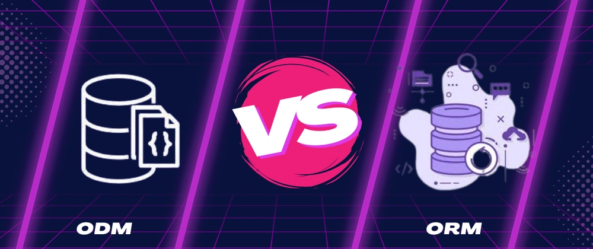

# 🏗️ ORMs & ODMs - Complete Workshop Series

<div align="center">



*Master Object-Relational Mapping and Object-Document Mapping in Node.js*

[](https://nodejs.org/)
[](https://www.mongodb.com/)
[](https://www.postgresql.org/)
[](https://mongoosejs.com/)
[](https://www.prisma.io/)

</div>

## 📚 Workshop Overview

Welcome to the comprehensive ORMs & ODMs workshop! This series takes you from fundamental concepts to building production-ready applications with modern database mapping tools.

### 🎯 Learning Objectives

By completing this workshop series, you will:

- ✅ **Understand** core concepts of ORMs and ODMs and their benefits
- ✅ **Connect** Node.js applications to MongoDB using Mongoose
- ✅ **Define** schemas and models to structure and validate data
- ✅ **Implement** data relationships and population techniques
- ✅ **Set up** Prisma as a modern, type-safe ORM for PostgreSQL
- ✅ **Perform** advanced CRUD operations with both tools
- ✅ **Build** real-world APIs with proper error handling and validation

## 🗂️ Workshop Structure

| Module | Topic | Difficulty |
|--------|-------|------------|
| **01** | [🚀 Introduction to ORMs & ODMs](./intro.md) | Beginner |
| **02** | [🍃 ODMs with Mongoose & MongoDB](./odms-mongoose.md) | Intermediate |
| **03** | [⚡ ORMs with Prisma & PostgreSQL](./orms-prisma.md) | Intermediate |

## 🛠️ Prerequisites

### Required Knowledge
- JavaScript ES6+ fundamentals
- Node.js and npm basics
- Basic understanding of databases
- HTTP methods and RESTful APIs

### Development Environment
- Node.js 18+, npm/yarn, Git
- Code editor (VS Code recommended)
- Database tools (MongoDB Compass, pgAdmin)

### Database Setup
- **MongoDB**: Atlas account or local installation
- **PostgreSQL**: Local installation or cloud provider

## 🚀 Quick Start

1. **Clone and setup**
   ```bash
   git clone <repository-url>
   cd web-journey/backend/sessions/02-orms-and-odms
   cd examples/mongoose-demo && npm install
   cd ../prisma-demo && npm install
   ```

2. **Start learning!**
   - Begin with [Introduction to ORMs & ODMs](./intro.md)
   - Continue with [ODMs with Mongoose](./odms-mongoose.md)
   - Finish with [ORMs with Prisma](./orms-prisma.md)

## 📁 Project Structure

```
02-orms-and-odms/
├── 📖 README.md              # Main entry point
├── 📝 intro.md               # Introduction to ORMs & ODMs
├── 🍃 odms-mongoose.md       # Mongoose & MongoDB workshop
├── ⚡ orms-prisma.md         # Prisma & PostgreSQL workshop
├── 📁 examples/              # Complete working examples
└── 📁 assets/                # Images and diagrams
```

## 🎯 What You'll Build

Build a complete **Course Management API** using both approaches:

| **Mongoose Project** | **Prisma Project** |
|:-------------------:|:------------------:|
| MongoDB + Express.js | PostgreSQL + Express.js |
| Schema validation | Type-safe queries |
| Population & refs | Relations & includes |

### Key Features
- 📚 **Course Management**: Full CRUD operations
- 📖 **Lesson Management**: Nested resource handling
- 🔗 **Relationships**: One-to-many relationships
- ✅ **Validation**: Data validation and error handling
- 🔍 **Querying**: Advanced filtering and population
- 🚀 **Performance**: Optimized database queries

## 🏆 Completion Benefits

Upon completion, you'll have:
- Built two complete APIs using different database approaches
- Mastered both SQL and NoSQL database interactions
- Understanding of when to use ORMs vs ODMs
- Production-ready code examples

## 📖 Additional Resources

### Official Documentation
- [Mongoose Documentation](https://mongoosejs.com/docs/)
- [Prisma Documentation](https://www.prisma.io/docs/)
- [Express.js Guide](https://expressjs.com/en/guide/)

### Community & Support
- [MongoDB University](https://university.mongodb.com/)
- [Prisma Community](https://www.prisma.io/community)
- [Stack Overflow](https://stackoverflow.com/questions/tagged/mongoose+prisma)

---

<div align="center">

**Ready to become an ORM/ODM master?** 🚀

[Start with Introduction →](./intro.md)

*Happy Coding!* 💻✨

</div>