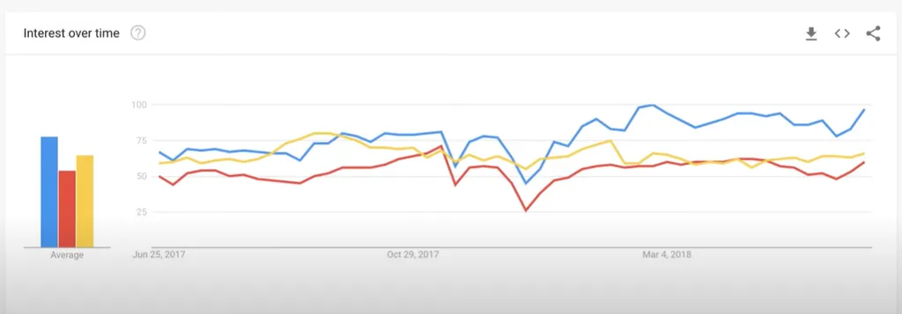
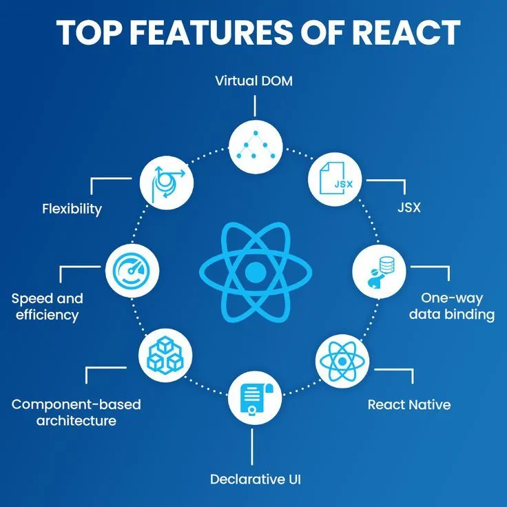

# Introduction to React

### **~~ What is React?**

React is a **JavaScript library** for building **user interfaces (UI)**. It was created by **Facebook** (now Meta) to make web applications ***faster, more interactive, and easier to manage.***

In simple terms, **React helps developers create web pages that update dynamically without refreshing the whole page**

**-→Example:** Imagine a website like **Facebook** or **Instagram**. When you like a post, the number of likes updates instantly **without refreshing the page**. React makes this possible!

---

---

### **~~ Why Use React? (Compared to Vanilla JavaScript & Other Frameworks)**

Before React, developers used **Vanilla JavaScript** (pure JavaScript) and frameworks like **Angular** and **Vue** to build web applications. But React became very popular because it makes web development **faster, simpler, and more efficient.**

### **~~Advantages of React over Vanilla JavaScript:**

 ~**Component-Based Approach** – Instead of writing messy code, React **divides your UI into small reusable components**.

 ~**Virtual DOM (Faster Updates)** – React updates only the **changed part** of the page, making it **super fast**.

**~Easier to Manage & Scale** – Unlike traditional JavaScript, React makes it **easy to build large applications**.

### *****React vs. Angular vs. Vue**

| Feature | React | Angular | Vue |
| --- | --- | --- | --- |
| **Type** | Library | Framework | Framework |
| **Learning Curve** | Easy to moderate | Hard (Many concepts) | Easy |
| **Performance** | Fast (Virtual DOM) | Moderate | Fast |
| **Used By** | Facebook, Instagram, Netflix | Google, Microsoft | Alibaba, Xiaomi |

---

## **Key features of React**

