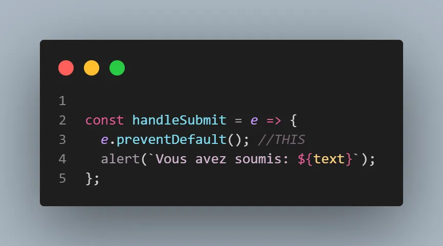
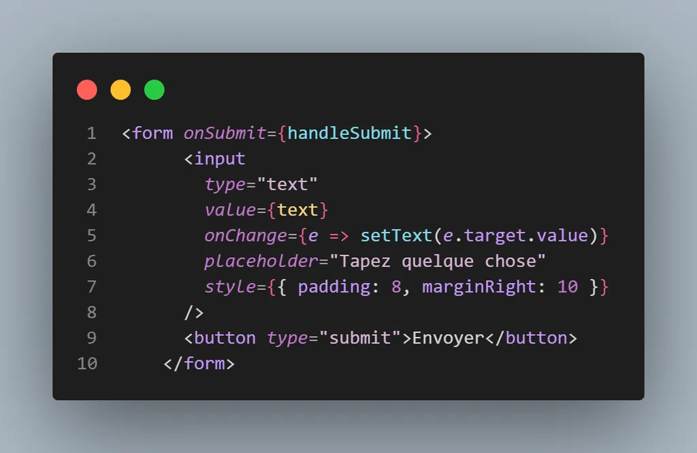

# **State & Event Handling**

### →Goal:

> understand how React manages dynamic data (state) and how to handle user interactions (events) like button clicks or form changes.
> 

---

---

### 1. **What is `state` in React?**

- State = internal data a component can **store** and **update**.

//ye3ni  c’est des données  **dakhel le composant**, w capable **ybedelo** m3a lwaqt.

- Think of it like a **variable that changes**, but when it changes, the **UI updates** automatically.

***With functional components, we use:**

```jsx
const [value, setValue] = useState(initialValue);
```

 **Example**:

```jsx
const [count, setCount] = useState(0);
//setValue hya li tbdel value -> VDOM Demo
```

*;;;"We create a state variable called `count`, and a function `setCount` to update it."*

**Demo this live with  `VDOMDemo`**

> Click the button → count changes → UI updates + background color changes
> 
> 
> *=> This is the Virtual DOM doing its job efficiently.*
> 

---

### 2. **What is `useEffect`?**

- `useEffect()` is used when we want to do something **after rendering**:
    - Fetch data
    - Listen to events
    - Update the document title, etc.

*"We'll use `useEffect` when we want to **react to changes**, or run code **on load**."*

See **HooksDemo** 

- typing in a search input
- result updates dynamically (after delay)

> "The effect is watching query, and updates results when query changes."
> 

---

### 3. **Handling Events in JSX**

- Events in React = **camelCase** (not lowercase like HTML)
- You pass a function to the event handler:

```jsx
<button onClick={handleClick}>Click</button>
<input onChange={handleChange} />

```

📌 *You’re not calling the function, just passing it like a prop.*

> "Events in React work like in JS — but inside JSX syntax."
> 

See the **EventsDemo**:

- Input + Submit form
- `onChange` updates the value
- `onSubmit` shows an alert

Saha "What do you think will happen if we don’t use `e.preventDefault()`



 in this form?"



### 4. **Props vs State** (Quick Recap)

| Feature | Props | State |
| --- | --- | --- |
| Source | Parent component | Inside the component |
| Editable? | ❌ Read-only | ✅ Mutable with `setState` |
| Usage | Pass data down | Manage internal behavior |

---

### 5. **Common Mistakes Beginners Make**

- ❌ Directly modifying state (e.g., `count++`)

//`count++` → Mauvais ! React ne verra pas le changement fl UI

- ❌ Forgetting to use `setState` (e.g., `setCount(count + 1)`)
- ❌ Calling event handlers instead of passing them (`onClick={handleClick()}` → wrong)