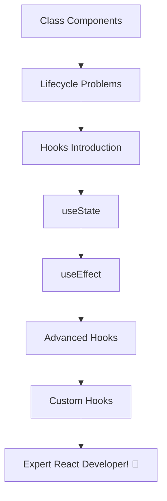

# 🎓 React Hooks Workshop for Beginners

Welcome to the **React Hooks Workshop**! 🚀

This comprehensive workshop will take you from React class components to modern functional components with Hooks. By the end, you'll be confident using state, effects, and creating your own custom hooks!

## 🎯 What You'll Learn

By completing this workshop, you will:

- ✅ Understand why Hooks were introduced and how they solve React's complexity
- ✅ Master `useState` for managing component state
- ✅ Use `useEffect` for side effects and lifecycle management
- ✅ Explore advanced hooks like `useRef`, `useReducer`, `useContext`, `useCallback`, and `useMemo`
- ✅ Build your own custom hooks for reusable logic
- ✅ Write cleaner, more maintainable React code

## 📚 Workshop Structure

| Section | Duration | Difficulty |
|---------|----------|------------|
| [1️⃣ **Component Lifecycle & Why Hooks**](./component-life-cycle.md) | 20 min | 🟢 Beginner |
| [2️⃣ **useState Basics & Closure Gotchas**](./use-state-basics.md)  | 25 min | 🟢 Beginner |
| [3️⃣ **useEffect & useLayoutEffect**](./side-effects.md)  | 30 min | 🟡 Intermediate |
| [4️⃣ **Advanced Hooks Overview**](./other-hooks.md)  | 35 min | 🟡 Intermediate |
| [5️⃣ **Creating Custom Hooks**](./custom-hooks.md)  | 25 min | 🟡 Intermediate |

## 📖 Workshop Navigation

### 🏁 Start Here: [Component Lifecycle & Why Hooks](./component-life-cycle.md)

Begin your journey by understanding how React evolved from class components to hooks.

---

### Core Hooks

1. **[useState Basics](./use-state-basics.md)** - Learn to manage state in functional components
2. **[useEffect & Side Effects](./side-effects.md)** - Handle lifecycle events and side effects

---

### Advanced Topics

3. **[Other Essential Hooks](./other-hooks.md)** - Explore useRef, useReducer, useContext, and more
4. **[Custom Hooks](./custom-hooks.md)** - Build reusable logic with your own hooks

---

## 💡 Learning Tips

| Tip | Description |
|-----|-------------|
| 🔄 **Practice** | Try each example in your own React app |
| 🧪 **Experiment** | Modify the examples to see what happens |
| 🤔 **Think** | Compare old class component patterns with hooks |
| 📝 **Notes** | Keep track of key concepts and gotchas |
| 🔗 **Connect** | See how hooks relate to problems you've faced |

## 🎨 Visual Learning Path

## 🔧 Hands-On Exercises

Throughout this workshop, you'll build:

- 📊 **Counter App** - Learn useState fundamentals
- 🌐 **Data Fetcher** - Master useEffect for API calls
- 🎨 **Theme Switcher** - Practice useContext for global state
- 📏 **Window Size Tracker** - Create your first custom hook
- 🧮 **Calculator** - Combine multiple hooks in a real app

## 📚 Additional Resources

After completing the workshop:

- 📖 [Official React Hooks Documentation](https://reactjs.org/docs/hooks-intro.html)
- 🎥 [React Hooks Video Tutorials](https://youtu.be/LlvBzyy-558?si=r95JIe4Z0C8KNspJ)
- 🛠️ [Hooks Testing Best Practices](https://medium.com/@ignatovich.dm/testing-react-hooks-best-practices-with-examples-d3fb5246aa09)

## 🏆 Ready to Start?

Click here to begin: **[Understanding Component Lifecycle & Why Hooks Matter](./component-life-cycle.md)**

Good luck on your React Hooks journey! 🚀✨
