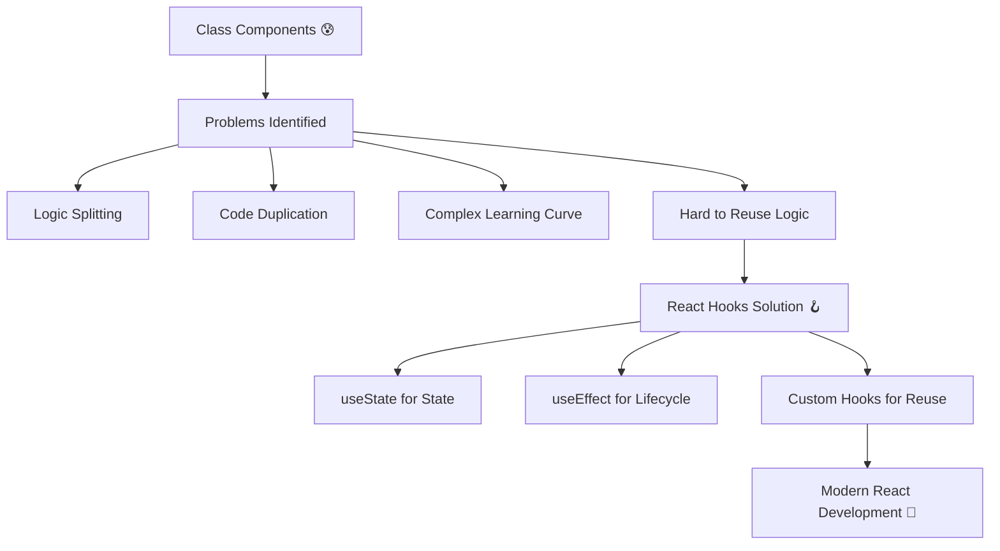
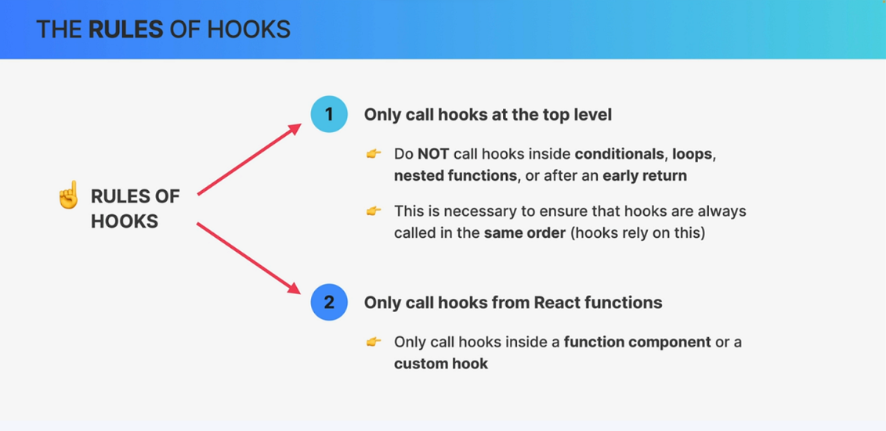

# 1️⃣ React Component Lifecycle & Why Hooks Were Created

> 🎯 **Goal**: Understand the evolution from class components to Hooks and why this change revolutionized React development.

## 📖 What is a Component Lifecycle?

Every React component goes through three main phases during its existence:

| Phase | Description | When It Happens |
|-------|-------------|-----------------|
| 🟢 **Mounting** | Component is created and added to the DOM | First time component renders |
| 🟡 **Updating** | Component re-renders due to state/props changes | State or props change |
| 🔴 **Unmounting** | Component is removed from the DOM | Component is destroyed |


## 🏛️ The Old Way: Class Components

Before Hooks (React < 16.8), we used **class components** with special lifecycle methods:

### 📋 Class Component Lifecycle Methods

| Method | Phase | Purpose | When It Runs |
|--------|-------|---------|--------------|
| `componentDidMount()` | 🟢 Mounting | Setup after first render | Once, after initial render |
| `componentDidUpdate()` | 🟡 Updating | React to state/props changes | After every re-render |
| `componentWillUnmount()` | 🔴 Unmounting | Cleanup before removal | Just before component is destroyed |

### 👇 Example: Class Component Counter

```jsx
import React, { Component } from 'react';

class ClassCounter extends Component {
  constructor(props) {
    super(props);
    this.state = { count: 0 };
  }

  // 🟢 MOUNTING: Runs after component is added to DOM
  componentDidMount() {
    console.log("✅ Component mounted!");
    document.title = `Count: ${this.state.count}`;
  }

  // 🟡 UPDATING: Runs after state or props change
  componentDidUpdate(prevProps, prevState) {
    console.log("🔄 Component updated!");
    if (prevState.count !== this.state.count) {
      document.title = `Count: ${this.state.count}`;
    }
  }

  // 🔴 UNMOUNTING: Cleanup before component is removed
  componentWillUnmount() {
    console.log("❌ Component will unmount!");
    document.title = "React App"; // Reset title
  }

  increment = () => {
    this.setState({ count: this.state.count + 1 });
  };

  render() {
    return (
      <div>
        <h2>Count: {this.state.count}</h2>
        <button onClick={this.increment}>Increment</button>
      </div>
    );
  }
}

export default ClassCounter;
```

### 😰 Problems with Class Components

| Problem | Description | Impact |
|---------|-------------|---------|
| 🔀 **Logic Splitting** | Related logic scattered across different methods | Hard to follow and maintain |
| 🔄 **Code Duplication** | Same logic repeated in multiple lifecycle methods | More bugs, harder to update |
| 📚 **Complexity** | Too many concepts to learn (this, binding, lifecycles) | Steep learning curve |
| ♻️ **Hard to Reuse** | Difficult to share stateful logic between components | Code duplication |

## 🪝 The Solution: React Hooks

Hooks were introduced in **React 16.8** to solve these problems:

### 🎯 Why Hooks?

| Benefit | Description |
|---------|-------------|
| 🧹 **Cleaner Code** | Keep related logic together |
| ♻️ **Better Reusability** | Share stateful logic easily |
| 📚 **Simpler Learning** | No classes, no `this`, no binding |
| 🔧 **Better Testing** | Easier to test individual pieces |

### 👇 Example: Same Counter with Hooks

```jsx
import React, { useState, useEffect } from 'react';

function FunctionalCounter() {
  const [count, setCount] = useState(0);

  // 🪝 ONE useEffect handles all lifecycle needs!
  useEffect(() => {
    // This runs after render (like componentDidMount + componentDidUpdate)
    console.log("✅ Effect ran!");
    document.title = `Count: ${count}`;

    // Cleanup function (like componentWillUnmount)
    return () => {
      console.log("🧹 Cleanup!");
      document.title = "React App";
    };
  }, [count]); // Only re-run when count changes

  const increment = () => {
    setCount(count + 1);
  };

  return (
    <div>
      <h2>Count: {count}</h2>
      <button onClick={increment}>Increment</button>
    </div>
  );
}

export default FunctionalCounter;
```

## 🔄 Class vs Hooks Comparison

### 📊 Side-by-Side Comparison

| Aspect | Class Components | Functional Components + Hooks |
|--------|------------------|-------------------------------|
| **State** | `this.state = {}` & `this.setState()` | `const [state, setState] = useState()` |
| **Mount** | `componentDidMount()` | `useEffect(() => {}, [])` |
| **Update** | `componentDidUpdate()` | `useEffect(() => {})` |
| **Unmount** | `componentWillUnmount()` | `useEffect(() => { return cleanup }, [])` |
| **Logic Organization** | Split across methods | Grouped by purpose |
| **Learning Curve** | Steep (classes, this, binding) | Gentle (just functions) |
| **Code Reuse** | Higher-Order Components (complex) | Custom Hooks (simple) |

### 📈 Code Length Comparison

```jsx
// ❌ Class Component (24 lines)
class Timer extends Component {
  constructor(props) {
    super(props);
    this.state = { time: 0 };
  }
  
  componentDidMount() {
    this.interval = setInterval(() => {
      this.setState({ time: this.state.time + 1 });
    }, 1000);
  }
  
  componentWillUnmount() {
    clearInterval(this.interval);
  }
  
  render() {
    return <div>Time: {this.state.time}s</div>;
  }
}

// ✅ Functional Component (12 lines)
function Timer() {
  const [time, setTime] = useState(0);
  
  useEffect(() => {
    const interval = setInterval(() => {
      setTime(time => time + 1);
    }, 1000);
    
    return () => clearInterval(interval);
  }, []);
  
  return <div>Time: {time}s</div>;pu
}
```

## 🎨 Visual Learning: The Evolution



## 🚀 Real-World Example: Data Fetching

### 🏛️ Class Component Way

```jsx
class UserProfile extends Component {
  constructor(props) {
    super(props);
    this.state = {
      user: null,
      loading: true,
      error: null
    };
  }

  async componentDidMount() {
    try {
      const response = await fetch(`/api/users/${this.props.userId}`);
      const user = await response.json();
      this.setState({ user, loading: false });
    } catch (error) {
      this.setState({ error: error.message, loading: false });
    }
  }

  async componentDidUpdate(prevProps) {
    if (prevProps.userId !== this.props.userId) {
      this.setState({ loading: true, error: null });
      try {
        const response = await fetch(`/api/users/${this.props.userId}`);
        const user = await response.json();
        this.setState({ user, loading: false });
      } catch (error) {
        this.setState({ error: error.message, loading: false });
      }
    }
  }

  render() {
    const { user, loading, error } = this.state;
    
    if (loading) return <div>Loading...</div>;
    if (error) return <div>Error: {error}</div>;
    if (!user) return <div>No user found</div>;
    
    return (
      <div>
        <h2>{user.name}</h2>
        <p>{user.email}</p>
      </div>
    );
  }
}
```

### 🪝 Hooks Way

```jsx
function UserProfile({ userId }) {
  const [user, setUser] = useState(null);
  const [loading, setLoading] = useState(true);
  const [error, setError] = useState(null);

  useEffect(() => {
    const fetchUser = async () => {
      setLoading(true);
      setError(null);
      
      try {
        const response = await fetch(`/api/users/${userId}`);
        const userData = await response.json();
        setUser(userData);
      } catch (err) {
        setError(err.message);
      } finally {
        setLoading(false);
      }
    };

    fetchUser();
  }, [userId]); // Re-run when userId changes

  if (loading) return <div>Loading...</div>;
  if (error) return <div>Error: {error}</div>;
  if (!user) return <div>No user found</div>;

  return (
    <div>
      <h2>{user.name}</h2>
      <p>{user.email}</p>
    </div>
  );
}
```

## 📏 The Rules of Hooks

Before we move forward, it's crucial to understand the **Rules of Hooks** - fundamental rules that make Hooks work correctly:



### 🔴 Rule #1: Only Call Hooks at the Top Level

**Never call Hooks inside loops, conditions, or nested functions.**

```jsx
// ❌ Wrong - Hook inside condition
function BadComponent({ shouldShow }) {
  if (shouldShow) {
    const [count, setCount] = useState(0); // ❌ Don't do this!
  }
  return <div>Bad example</div>;
}

// ❌ Wrong - Hook inside loop
function AnotherBadComponent() {
  for (let i = 0; i < 3; i++) {
    const [value, setValue] = useState(i); // ❌ Don't do this!
  }
  return <div>Another bad example</div>;
}

// ✅ Correct - Hooks at top level
function GoodComponent({ shouldShow }) {
  const [count, setCount] = useState(0); // ✅ Always at the top!
  const [name, setName] = useState('');   // ✅ Always at the top!
  
  if (shouldShow) {
    // Use the state values here instead
    return <div>Count: {count}</div>;
  }
  
  return <div>Hidden</div>;
}
```

### 🔴 Rule #2: Only Call Hooks from React Functions

**Call Hooks only from React function components or custom Hooks.**

```jsx
// ❌ Wrong - Hook in regular function
function regularFunction() {
  const [data, setData] = useState([]); // ❌ Don't do this!
  return data;
}

// ❌ Wrong - Hook in class component
class ClassComponent extends Component {
  someMethod() {
    const [count, setCount] = useState(0); // ❌ Don't do this!
  }
}

// ✅ Correct - Hook in function component
function FunctionComponent() {
  const [count, setCount] = useState(0); // ✅ Perfect!
  return <div>{count}</div>;
}

// ✅ Correct - Hook in custom Hook
function useCustomHook() {
  const [data, setData] = useState([]); // ✅ Perfect!
  return data;
}
```

### 🤔 Why These Rules Matter

| Rule | Why It's Important | What Happens If Broken |
|------|-------------------|------------------------|
| **Top Level Only** | React relies on call order to track Hook state | State gets mixed up between renders |
| **React Functions Only** | Hooks need React's rendering context | Hooks won't work at all |

### 🔍 How React Tracks Hooks

React uses the **order of Hook calls** to associate state with components:

```jsx
function Component() {
  // First Hook call - React associates this with "Hook 0"
  const [name, setName] = useState('');
  
  // Second Hook call - React associates this with "Hook 1"  
  const [age, setAge] = useState(0);
  
  // Third Hook call - React associates this with "Hook 2"
  useEffect(() => {
    document.title = name;
  }, [name]);
  
  // React expects the same order every time!
}
```

### 🛠️ ESLint Plugin for Hook Rules

Install the React Hooks ESLint plugin to catch rule violations:

```bash
npm install eslint-plugin-react-hooks --save-dev
```

```json
// .eslintrc.json
{
  "plugins": ["react-hooks"],
  "rules": {
    "react-hooks/rules-of-hooks": "error",
    "react-hooks/exhaustive-deps": "warn"
  }
}
```

## ✅ Key Takeaways

| 💡 Concept | Explanation |
|------------|-------------|
| **Lifecycle Evolution** | Class methods → useEffect Hook |
| **Logic Grouping** | Related code stays together |
| **Simpler Syntax** | No classes, no `this` binding |
| **Better Reusability** | Custom Hooks make sharing logic easy |
| **Easier Testing** | Test individual pieces in isolation |
| **Hook Rules** | Always call at top level, only in React functions |

## 🎯 What's Next?

Now that you understand **why** Hooks exist, let's learn **how** to use them:

1. **[Next: useState Basics →](./use-state-basics.md)** - Learn to manage state in functional components

## 📚 Additional Resources

- 📖 [React Docs: State and Lifecycle](https://reactjs.org/docs/state-and-lifecycle.html)
- 📖 [React Docs: Introducing Hooks](https://reactjs.org/docs/hooks-intro.html)
- 🎥 [Dan Abramov: React Hooks Introduction](https://www.youtube.com/watch?v=dpw9EHDh2bM)
- 📝 [Blog: The Evolution from Classes to Hooks](https://blog.logrocket.com/react-hooks-versus-classes/)

---

**[← Back to Workshop Home](./README.md)** | **[Next: useState Basics →](./use-state-basics.md)**