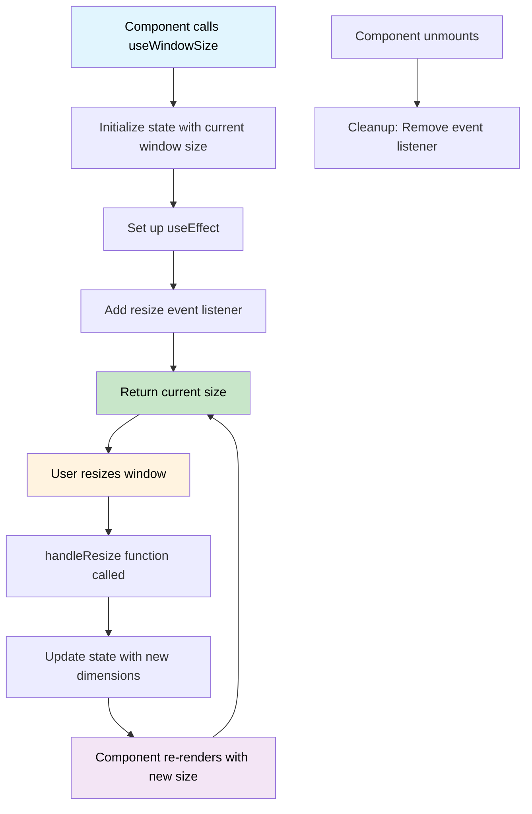

# 5️⃣ Creating Custom Hooks - The Ultimate Reusability Tool

> ⚡️ **Custom Hooks** are the secret sauce for making your React code **reusable**, **readable**, and **powerful**.

## 📖 What Are Custom Hooks?

A **custom hook** is just a JavaScript **function** that uses one or more built-in React Hooks (`useState`, `useEffect`, `useRef`, etc.) to:
✅ **Encapsulate** state and logic.
✅ Make it **reusable** across multiple components.

> ✅ They always **start with `use`** (e.g., `useWindowSize`, `useFetchData`).


---

## ⚡️ Why Are Custom Hooks Important?

| Benefit                   | Explanation                                               |
| ------------------------- | --------------------------------------------------------- |
| ♻️ **Reusability**        | Share stateful logic across components.                   |
| 🧹 **Cleaner Code**       | Extract messy logic out of components.                    |
| 🔥 **Better Abstraction** | Focus on the component's structure, move logic elsewhere. |
| ⚡️ **Better Maintenance** | Maintain and test logic in isolation.                     |
| 🧪 **Easier Testing**     | Test complex logic separately from UI.                    |

---

## 👇 Example 1: Creating a Simple `useWindowSize` Hook

> This hook tracks the **browser window dimensions** (`width` and `height`) and returns them.

### ✅ Usage

```jsx
import React from 'react';
import { useWindowSize } from './useWindowSize';

function App() {
  const { width, height } = useWindowSize();

  return (
    <div>
      <h2>Window Size</h2>
      <p>Width: {width}px</p>
      <p>Height: {height}px</p>
      <div style={{
        fontSize: width < 768 ? '14px' : '18px',
        color: width < 768 ? 'red' : 'green'
      }}>
        {width < 768 ? 'Mobile View' : 'Desktop View'}
      </div>
    </div>
  );
}
```

---

### ⚡️ The `useWindowSize` Hook

```jsx
// useWindowSize.js
import { useState, useEffect } from 'react';

export function useWindowSize() {
  const [size, setSize] = useState({
    width: window.innerWidth,
    height: window.innerHeight,
  });

  useEffect(() => {
    function handleResize() {
      setSize({
        width: window.innerWidth,
        height: window.innerHeight,
      });
    }

    window.addEventListener('resize', handleResize);
    return () => {
      window.removeEventListener('resize', handleResize);
    };
  }, []);

  return size;
}
```



---

## 👇 Example 2: Creating a `useFetchData` Hook

> This hook fetches data from an API and returns the `data`, `loading`, and `error` status.

### ✅ Usage

```jsx
import React from 'react';
import { useFetchData } from './useFetchData';

function PostList() {
  const { data, loading, error } = useFetchData('https://jsonplaceholder.typicode.com/posts');

  if (loading) return <h2>Loading...</h2>;
  if (error) return <h2>Error: {error}</h2>;

  return (
    <div>
      <h2>Post List</h2>
      <ul>
        {data.slice(0, 5).map((post) => (
          <li key={post.id}>
            <h3>{post.title}</h3>
            <p>{post.body.substring(0, 100)}...</p>
          </li>
        ))}
      </ul>
    </div>
  );
}

// You can reuse the same hook for different data
function UserList() {
  const { data: users, loading, error } = useFetchData('https://jsonplaceholder.typicode.com/users');
  
  if (loading) return <div>Loading users...</div>;
  if (error) return <div>Error loading users: {error}</div>;
  
  return (
    <ul>
      {users.map(user => (
        <li key={user.id}>{user.name} - {user.email}</li>
      ))}
    </ul>
  );
}
```

---

### ⚡️ The `useFetchData` Hook

```jsx
// useFetchData.js
import { useState, useEffect } from 'react';

export function useFetchData(url) {
  const [data, setData] = useState([]);
  const [loading, setLoading] = useState(true);
  const [error, setError] = useState('');

  useEffect(() => {
    async function fetchData() {
      try {
        setLoading(true);
        setError('');
        
        const response = await fetch(url);
        if (!response.ok) {
          throw new Error(`Error: ${response.status}`);
        }
        const result = await response.json();
        setData(result);
      } catch (err) {
        setError(err.message);
        setData([]);
      } finally {
        setLoading(false);
      }
    }

    fetchData();
  }, [url]);

  return { data, loading, error };
}
```

---

## 🔥 Example 3: Advanced Custom Hook - `useLocalStorage`

This hook synchronizes state with localStorage:

### ✅ Usage

```jsx
function Settings() {
  const [theme, setTheme] = useLocalStorage('theme', 'light');
  const [username, setUsername] = useLocalStorage('username', '');
  
  return (
    <div>
      <h2>Settings</h2>
      
      <div>
        <label>Theme: </label>
        <select value={theme} onChange={(e) => setTheme(e.target.value)}>
          <option value="light">Light</option>
          <option value="dark">Dark</option>
        </select>
      </div>
      
      <div>
        <label>Username: </label>
        <input
          value={username}
          onChange={(e) => setUsername(e.target.value)}
          placeholder="Enter username"
        />
      </div>
      
      <div>
        <h3>Current Settings:</h3>
        <p>Theme: {theme}</p>
        <p>Username: {username}</p>
      </div>
    </div>
  );
}
```

### ⚡️ The `useLocalStorage` Hook

```jsx
// useLocalStorage.js
import { useState, useEffect } from 'react';

export function useLocalStorage(key, initialValue) {
  // Get initial value from localStorage or use provided initial value
  const [storedValue, setStoredValue] = useState(() => {
    try {
      const item = window.localStorage.getItem(key);
      return item ? JSON.parse(item) : initialValue;
    } catch (error) {
      console.error(`Error reading localStorage key "${key}":`, error);
      return initialValue;
    }
  });

  // Return a wrapped version of useState's setter function that persists to localStorage
  const setValue = (value) => {
    try {
      // Allow value to be a function so we have the same API as useState
      const valueToStore = value instanceof Function ? value(storedValue) : value;
      setStoredValue(valueToStore);
      window.localStorage.setItem(key, JSON.stringify(valueToStore));
    } catch (error) {
      console.error(`Error setting localStorage key "${key}":`, error);
    }
  };

  return [storedValue, setValue];
}
```

---

## 🔄 Example 4: Custom Hook with Multiple Hooks - `useCounter`

This hook demonstrates how to combine multiple built-in hooks:

### ✅ Usage

```jsx
function CounterComponent() {
  const { count, increment, decrement, reset, set } = useCounter(0, { min: 0, max: 100 });
  
  return (
    <div>
      <h2>Count: {count}</h2>
      
      <button onClick={decrement}>-1</button>
      <button onClick={increment}>+1</button>
      <button onClick={() => set(50)}>Set to 50</button>
      <button onClick={reset}>Reset</button>
      
      <div>
        <input
          type="range"
          min="0"
          max="100"
          value={count}
          onChange={(e) => set(parseInt(e.target.value))}
        />
      </div>
    </div>
  );
}
```

### ⚡️ The `useCounter` Hook

```jsx
// useCounter.js
import { useState, useCallback } from 'react';

export function useCounter(initialValue = 0, options = {}) {
  const { min, max } = options;
  const [count, setCount] = useState(initialValue);

  const increment = useCallback(() => {
    setCount(prevCount => {
      const newCount = prevCount + 1;
      return max !== undefined ? Math.min(newCount, max) : newCount;
    });
  }, [max]);

  const decrement = useCallback(() => {
    setCount(prevCount => {
      const newCount = prevCount - 1;
      return min !== undefined ? Math.max(newCount, min) : newCount;
    });
  }, [min]);

  const reset = useCallback(() => {
    setCount(initialValue);
  }, [initialValue]);

  const set = useCallback((value) => {
    setCount(prevCount => {
      let newValue = typeof value === 'function' ? value(prevCount) : value;
      
      // Apply min/max constraints
      if (min !== undefined) newValue = Math.max(newValue, min);
      if (max !== undefined) newValue = Math.min(newValue, max);
      
      return newValue;
    });
  }, [min, max]);

  return { count, increment, decrement, reset, set };
}
```

---

## 📋 More Practical Custom Hook Examples

### 🎯 `useToggle` Hook

```jsx
// useToggle.js
import { useState, useCallback } from 'react';

export function useToggle(initialValue = false) {
  const [value, setValue] = useState(initialValue);
  
  const toggle = useCallback(() => setValue(prev => !prev), []);
  const setTrue = useCallback(() => setValue(true), []);
  const setFalse = useCallback(() => setValue(false), []);
  
  return [value, { toggle, setTrue, setFalse }];
}

// Usage
function Modal() {
  const [isOpen, { toggle, setTrue, setFalse }] = useToggle(false);
  
  return (
    <div>
      <button onClick={setTrue}>Open Modal</button>
      {isOpen && (
        <div className="modal">
          <h2>Modal Content</h2>
          <button onClick={setFalse}>Close</button>
          <button onClick={toggle}>Toggle</button>
        </div>
      )}
    </div>
  );
}
```

### 🎯 `useDebounce` Hook

```jsx
// useDebounce.js
import { useState, useEffect } from 'react';

export function useDebounce(value, delay) {
  const [debouncedValue, setDebouncedValue] = useState(value);

  useEffect(() => {
    const handler = setTimeout(() => {
      setDebouncedValue(value);
    }, delay);

    return () => {
      clearTimeout(handler);
    };
  }, [value, delay]);

  return debouncedValue;
}

// Usage
function SearchComponent() {
  const [searchTerm, setSearchTerm] = useState('');
  const debouncedSearchTerm = useDebounce(searchTerm, 500);
  
  useEffect(() => {
    if (debouncedSearchTerm) {
      // Perform search
      console.log('Searching for:', debouncedSearchTerm);
    }
  }, [debouncedSearchTerm]);
  
  return (
    <input
      type="text"
      value={searchTerm}
      onChange={(e) => setSearchTerm(e.target.value)}
      placeholder="Search..."
    />
  );
}
```

---

## ⚡️ Rules for Creating Custom Hooks

| Rule | Why It's Important | Example |
|------|-------------------|---------|
| ✅ Must **start with `use`** | React identifies it as a hook | `useFetchData`, not `fetchData` |
| ✅ Must be called **inside** a component or another hook | Follow hooks rules | Only at top level |
| ✅ Must only call **other hooks** inside itself | Maintain hooks order | `useState`, `useEffect` inside custom hook |
| ✅ Should be **pure** and **predictable** | Avoid side effects in hook creation | Return consistent values |

---

## 🌟 Custom Hook Best Practices

| ✅ Do | ❌ Don't |
|-------|----------|
| Use descriptive names (`useUserData`) | Use generic names (`useHook`) |
| Return objects for multiple values | Return arrays with many items |
| Handle loading and error states | Ignore error handling |
| Use TypeScript for better DX | Skip type definitions |
| Test your hooks independently | Only test through components |

### 📊 Return Value Patterns

```jsx
// ✅ Good - Object with named properties
function useUserData(userId) {
  return { user, loading, error, refetch };
}

// ❌ Avoid - Array with many items
function useUserData(userId) {
  return [user, loading, error, refetch, isValidating, mutate];
}

// ✅ Good - Array for simple toggle-like values
function useToggle(initial) {
  return [isOpen, toggle];
}
```

---

## 🧪 Testing Custom Hooks

### Using React Testing Library

```jsx
// useCounter.test.js
import { renderHook, act } from '@testing-library/react';
import { useCounter } from './useCounter';

describe('useCounter', () => {
  it('should initialize with default value', () => {
    const { result } = renderHook(() => useCounter());
    expect(result.current.count).toBe(0);
  });

  it('should increment count', () => {
    const { result } = renderHook(() => useCounter(0));
    
    act(() => {
      result.current.increment();
    });
    
    expect(result.current.count).toBe(1);
  });

  it('should respect max value', () => {
    const { result } = renderHook(() => useCounter(5, { max: 5 }));
    
    act(() => {
      result.current.increment();
    });
    
    expect(result.current.count).toBe(5); // Should not exceed max
  });
});
```

---

## 🎯 When to Create Custom Hooks

| Scenario | Create Custom Hook? | Why |
|----------|-------------------|-----|
| Logic used in 2+ components | ✅ Yes | DRY principle |
| Complex stateful logic | ✅ Yes | Better organization |
| API integration patterns | ✅ Yes | Consistent error handling |
| Simple one-off logic | ❌ No | Unnecessary abstraction |

---

## 📚 Real-World Custom Hook Library

Here's a collection of hooks you might create for a real application:

```jsx
// hooks/index.js
export { useLocalStorage } from './useLocalStorage';
export { useFetchData } from './useFetchData';
export { useDebounce } from './useDebounce';
export { useToggle } from './useToggle';
export { useCounter } from './useCounter';
export { useWindowSize } from './useWindowSize';
export { useOnlineStatus } from './useOnlineStatus';
export { usePrevious } from './usePrevious';
```

### `useOnlineStatus` Hook

```jsx
// useOnlineStatus.js
import { useState, useEffect } from 'react';

export function useOnlineStatus() {
  const [isOnline, setIsOnline] = useState(navigator.onLine);

  useEffect(() => {
    function handleOnline() {
      setIsOnline(true);
    }

    function handleOffline() {
      setIsOnline(false);
    }

    window.addEventListener('online', handleOnline);
    window.addEventListener('offline', handleOffline);

    return () => {
      window.removeEventListener('online', handleOnline);
      window.removeEventListener('offline', handleOffline);
    };
  }, []);

  return isOnline;
}
```

---

## ✅ Key Takeaways

| 💡 Concept | Explanation |
|------------|-------------|
| **Reusability** | Share stateful logic across components effortlessly |
| **Abstraction** | Hide complex logic behind simple interfaces |
| **Testing** | Test logic independently from UI components |
| **Organization** | Keep components focused on rendering |
| **Maintainability** | Update logic in one place, benefit everywhere |

---

## 🌟 What's Next?

Try creating your own custom hooks:
✅ `useAuth()` — Handle user authentication state.
✅ `useApi()` — Generic API calling hook with caching.
✅ `useForm()` — Handle form state and validation.
✅ `useTheme()` — Manage application theme.

## 📚 Additional Resources

* [React Docs: Building Your Own Hooks](https://react.dev/learn/reusing-logic-with-custom-hooks)
* [Blog: Patterns for Custom Hooks](https://kentcdodds.com/blog/how-to-create-custom-react-hooks)
* [Custom Hooks Collection](https://usehooks.com/)
* [Awesome React Hooks](https://github.com/rehooks/awesome-react-hooks)

---

**[← Back: Other Essential Hooks](./other-hooks.md)** | **[🏠 Back to Workshop Home](./README.md)**